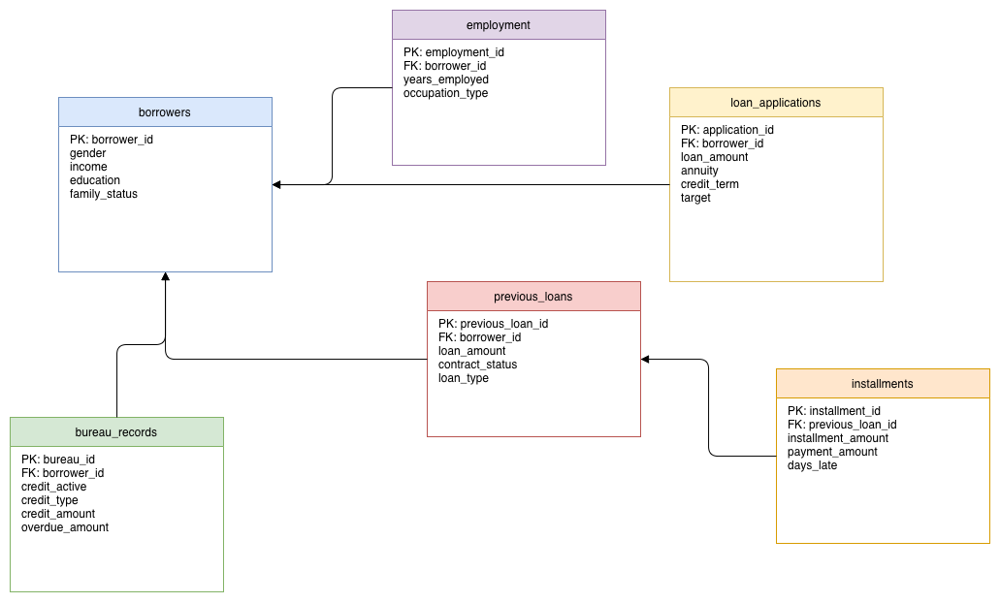
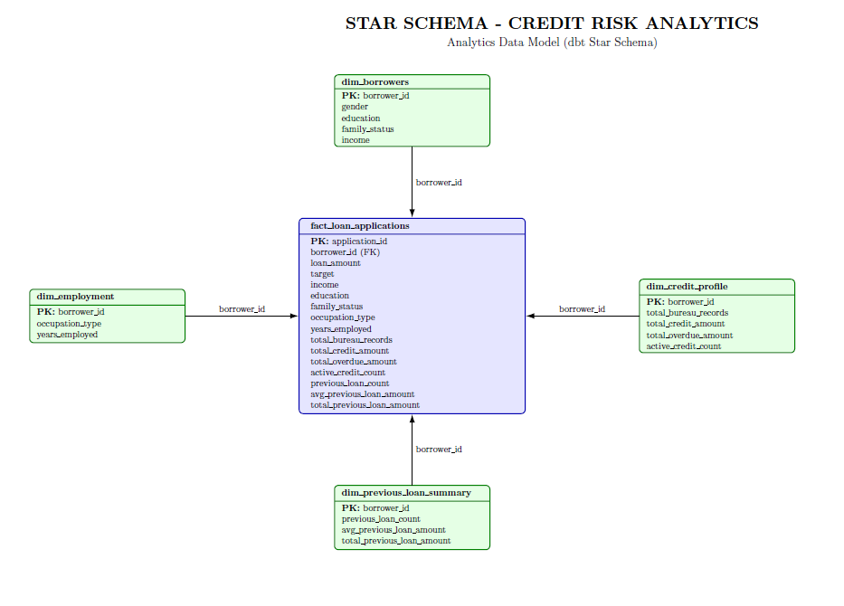

# Credit Risk Analytics Database

## Project Overview

This project ingests and models raw credit risk datasets into a **normalized PostgreSQL database** hosted on Neon and builds an analytics layer using **dbt (Data Build Tool)** for reporting, testing, and performance optimization.

The system supports:

- Secure and scalable PostgreSQL data storage
- Automated data ingestion using Python + SQLAlchemy
- OLTP schema in Third Normal Form (3NF)
- Analytics-ready Star Schema using dbt
- Data quality testing using dbt tests
- CI/CD with GitHub Actions + SQLFluff
- Advanced analytical SQL queries with performance tuning

---

## Dataset

The project uses the following datasets (all CSV files stored in `data/`):

- `application_train.csv` – Borrower demographic and financial data
- `bureau.csv` – Credit bureau records
- `previous_application.csv` – Historical loan data
- `installments_payments.csv` – Installment payments for previous loans

- [Find and download the dataset in this link](https://buffalo.box.com/s/z3wlswzqif58vksdiaixkogzhdkzb7w9)

---

# Phase 1 — OLTP Database Design

## Database Design (3NF)

The database is normalized to **Third Normal Form (3NF)** to:

- Eliminate redundancy
- Avoid update, insert, and delete anomalies
- Support secure and efficient data ingestion

## Entity Relationship Diagram (ERD)



---

## Entities

| Table | Description |
|---|---|
| `borrowers` | Stores borrower demographic and financial information |
| `employment` | Employment details for borrowers |
| `loan_applications` | New loan requests |
| `bureau_records` | Active and historical credit bureau information |
| `previous_loans` | Historical loans of borrowers |
| `installments` | Installment payments for previous loans |

## Relationships

- One-to-many between Borrowers → Employment
- One-to-many between Borrowers → Loan Applications
- One-to-many between Borrowers → Bureau Records
- One-to-many between Borrowers → Previous Loans
- One-to-many between Previous Loans → Installments

---

# Phase 2 — Analytics Layer with dbt

## Star Schema Design

A separate analytics layer was built using **dbt** to transform the OLTP schema into an optimized **Star Schema** for reporting and advanced SQL analysis.

### Central Fact Table

### `fact_loan_applications`

This table stores:

- loan application outcomes
- borrower financial profile
- credit exposure
- previous loan history
- employment features

### Dimension Tables

- `dim_borrowers`
- `dim_employment`
- `dim_credit_profile`
- `dim_previous_loan_summary`

---

## Star Schema Diagram



---

## dbt Features Implemented

### Staging Layer

Created dbt staging models for:

- stg_borrowers
- stg_employment
- stg_loan_applications
- stg_bureau_records
- stg_previous_loans
- stg_installments

### Marts Layer

Created final analytics tables:

- fact_loan_applications
- dim_borrowers
- dim_employment
- dim_credit_profile
- dim_previous_loan_summary

### dbt Tests

Implemented:

- `unique`
- `not_null`
- `relationships`

All tests passed successfully.

### dbt Docs

Generated dbt documentation with:

- model lineage graph
- model catalog
- dependency visualization

---

## CI/CD Automation

Implemented GitHub Actions workflow:

```text
.github/workflows/ci.yml